<a href="#the-workbench">
  
</a>

<p align="center">
  Backend engineer building distributed systems, realtime tools, and software that remains understandable under load.
</p>

<p align="center">
  <a href="https://github.com/WickTheThird/Nogur"><strong>Explore Nogur</strong></a>
  &nbsp;·&nbsp;
  <a href="https://www.linkedin.com/in/filip-bumbu-410741262/"><strong>Say hello</strong></a>
</p>

<br />

## The workbench

<table>
  <tr>
    <td width="33%" valign="top">
      <sub>NOW</sub><br /><br />
      <strong>Messaging at scale</strong><br />
      Building and operating backend services at Telnyx, where reliability is part of the feature.
    </td>
    <td width="33%" valign="top">
      <sub>BUILDING</sub><br /><br />
      <strong><a href="https://github.com/WickTheThird/Nogur">Nogur ↗</a></strong><br />
      A native system for controlling and extending your Mac from another computer—phones are next.
    </td>
    <td width="33%" valign="top">
      <sub>EXPLORING</sub><br /><br />
      <strong>Systems with edges</strong><br />
      Realtime media, language tooling, embedded devices, and better ways for machines to cooperate.
    </td>
  </tr>
</table>

<br />

```text
incoming idea
    │
    ├── make the boundaries explicit
    ├── keep the hot path observable
    ├── test what breaks under pressure
    └── ship the smallest honest system
```

<details>
  <summary><strong>Open the systems drawer</strong></summary>
  <br />

  I spend most of my time around Python, FastAPI, PostgreSQL, Redis, RabbitMQ, Kafka, SQLAlchemy, and Docker. I reach for C, C++, Kotlin, Bash, or Swift when the problem moves closer to the machine—or onto a different one entirely.

  The recurring theme is less about a particular stack and more about behavior: concurrency, failure modes, observability, and systems that people can still reason about six months later.
</details>

<details>
  <summary><strong>Open the field notes</strong></summary>
  <br />

  - **Telnyx · Software Engineer** — production messaging services, event-driven systems, incident response, and reliability.
  - **Druid Software · Software Engineer** — telecom backends, systems debugging, testing, and delivery automation.
  - **Tributum · Software Engineer** — financial workflows, Django services, internal tools, and React interfaces.
  - **AA Construction · Full-Stack Developer** — realtime communication with WebRTC and interactive 3D experiences.

  BSc in Computer Science & Software Engineering from Dublin City University.
</details>

<details>
  <summary><strong>Open the project archive</strong></summary>
  <br />

  | Project | What lives inside |
  |:--|:--|
  | **[CAL Compiler](https://github.com/WickTheThird/CAL-Compiler)** | A programming-language project exploring compilers and execution models. |
  | **[Omnisense](https://github.com/WickTheThird/Omnisense)** | Wearable navigation assistance using microcontrollers, sensors, GPS, and Android. |
  | **MyShell** | A UNIX-like shell with multiprocessing, batch execution, and I/O redirection. |
  | **Amberscan** | Android receipt capture with OCR and structured financial export. |
  | **Cloud Storage Platform** | Self-hosted storage and collaborative editing with Django and Svelte. |
</details>

<br />

<p align="center">
  <sub>Clear boundaries. Useful signals. Fewer mysterious boxes.</sub>
</p>
