  

## Hey.

I'm Filip. I write backend services at **Telnyx**. When I'm not doing that, I usually have one side project too many.

Most of them start with “wouldn't it be cool if…” and I figure out the stack afterwards. That has taken me through compilers, tiny computers, Android apps, WebRTC, 3D experiments, and the occasional shell. Python is home base, but I'm always happy to wander into something lower-level or completely unfamiliar.

I enjoy finding out why a system behaves the way it does—especially when it misbehaves.

### A few things I've made

- [CAL Compiler](https://github.com/WickTheThird/CAL-Compiler) — a compiler for a language of my own.
- [Omnisense](https://github.com/WickTheThird/Omnisense) — wearable navigation assistance built with sensors, GPS, microcontrollers, and Android.
- [HashIDE](https://github.com/WickTheThird/HashIDE) — a browser-based editor for building and deploying full-stack applications.
- [Tributum](https://github.com/WickTheThird/Tributum) — software made for a real accounting business.

  
<strong>The slightly more formal version</strong>

   

  I have worked across telecom, financial software, realtime communication, and web products at Telnyx, Druid Software, Tributum, and AA Construction. Along the way I have used Python, FastAPI, Django, PostgreSQL, Redis, RabbitMQ, Kafka, C, C++, Kotlin, JavaScript, Swift, and whatever else the problem called for.

  I studied Computer Science & Software Engineering at Dublin City University.

---

If any of that sounds interesting, come say hello on [LinkedIn](https://www.linkedin.com/in/filip-bumbu-410741262/).
